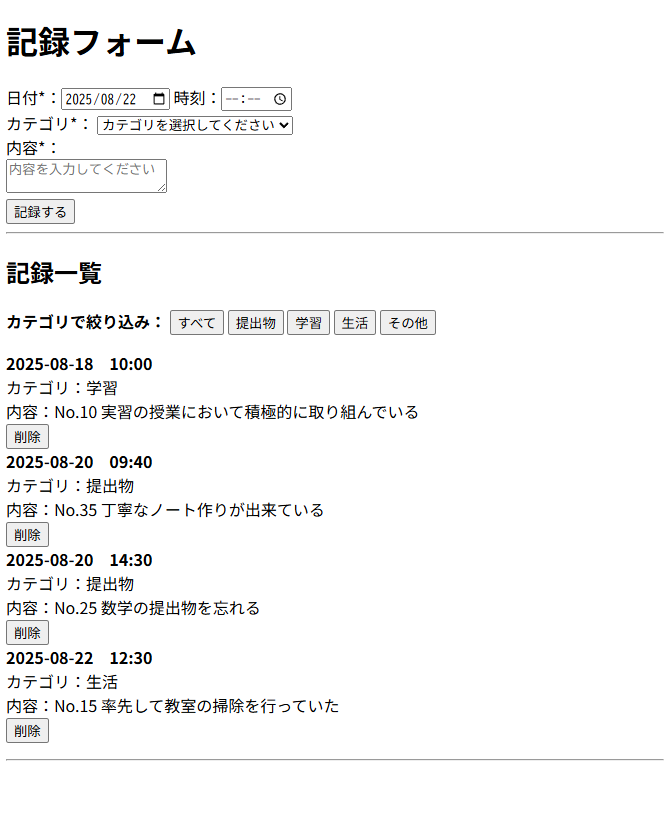

# 記録管理ツール

日々の活動や気づきを素早く記録・管理できるシンプルなWebアプリケーションです。

## 📋 概要

このツールは、業務記録や学習メモを効率的に管理するために開発しました。複雑な機能を省き、「素早い記録」と「簡単な振り返り」に特化しています。


*実際の画面イメージ*

## ✨ 主な機能

- **📝 記録入力**: 日付・時刻・カテゴリ・内容を簡単入力
- **🏷️ カテゴリ分類**: 提出物・学習・生活・その他で自動分類
- **🔍 フィルタリング**: カテゴリ別に記録を絞り込み表示
- **📅 時系列表示**: 日時順に自動ソートして表示
- **🗑️ 削除機能**: 不要な記録を安全に削除

## 🚀 デモ

**[→ 実際に試してみる](https://atarin2.github.io/input_form/)**

## 🛠️ 使用技術

- **HTML5**: セマンティックなマークアップ
- **CSS3**: レスポンシブデザイン対応
- **JavaScript (ES6+)**: バニラJSで軽量実装

## 💡 開発のポイント

### 1. ユーザビリティ重視
- フォーム送信後の自動リセット
- デフォルトで当日日付を設定
- 削除前の確認ダイアログ

### 2. 効率的なデータ処理
```javascript
// 日時順ソート処理
const sortedRecords = [...records].sort((a, b) => {
    const dateTimeA = new Date(a.date + ' ' + (a.time || "00:00"));
    const dateTimeB = new Date(b.date + ' ' + (b.time || "00:00"));
    return dateTimeA - dateTimeB;
});
```

### 3. レスポンシブ対応
- モバイルファースト設計
- タッチデバイスでの操作性を考慮

## 📱 使い方

1. **記録作成**
- 日付（自動で今日が設定されます）
- 時刻（任意）
- カテゴリを選択
- 内容を入力して「記録する」

2. **記録の確認**
- 時系列で自動表示
- カテゴリボタンで絞り込み可能

3. **記録の削除**
- 各記録の「削除」ボタンをクリック
- 確認ダイアログで安全に削除

## 🔧 ローカルでの実行方法

```bash
# リポジトリをクローン
git clone https://github.com/yourusername/record-manager.git

# ディレクトリに移動
cd record-manager

# ブラウザでindex.htmlを開く
```

## 🚧 今後の改善予定

-  LocalStorageによるデータ永続化
-  CSVエクスポート機能
-  検索機能の追加
-  ダークモード対応
-  PWA化でオフライン対応


## 📄 ライセンス

MIT License

---
**開発者**: [あなたの名前]  
**連絡先**: [メールアドレス]  
**ポートフォリオ**: [ポートフォリオURL]
